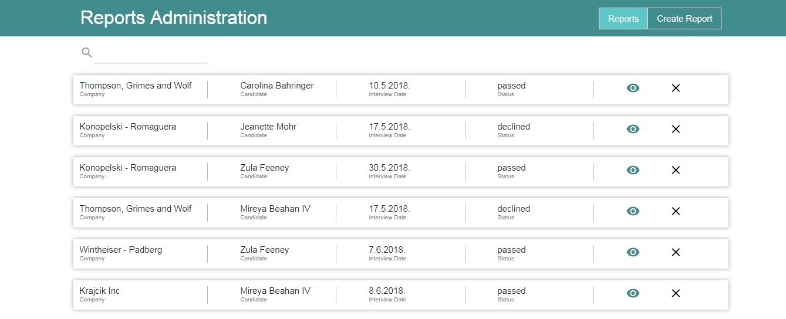
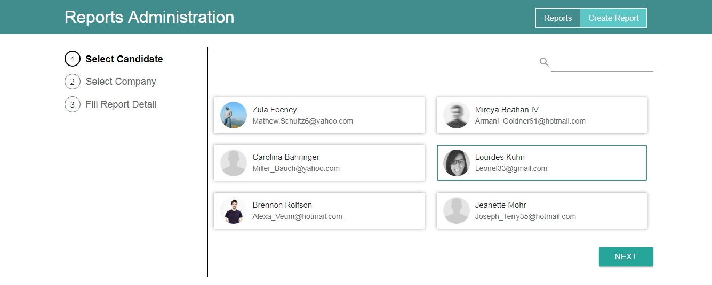
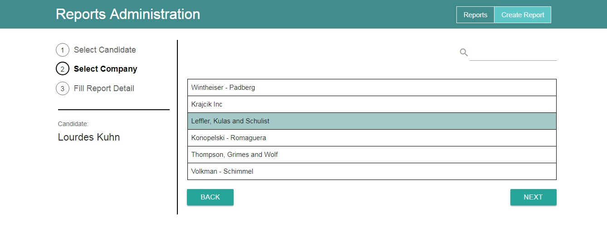
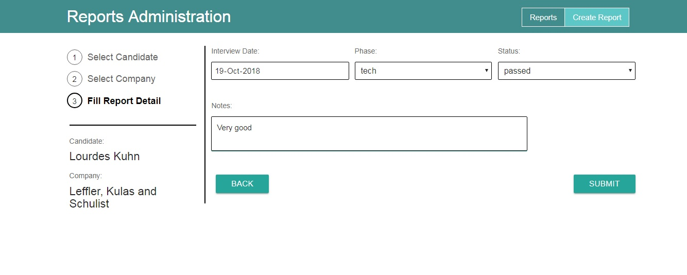

# Interview reports admin panel

> Admin panel used for creation of interview reports from candidates at different companies, written in React.js

Mock API used for development of this project:

[https://github.com/nenadbugaric/interviews-reports-api-mock]






## Installation

```sh
npm install
npm start
```

## Project structure

* app - Components
    * App.js
    * pages
        * HomePage
            * HomePage.js
            * Modal.js
            * ReportList.js
        * SubmitReport
            * SelectCandidate
                * CandidateList.js
                * SelectCandidate.js
    	    * SelectCompany
                * CompanyList.js
                * SelectCompany.js
            * FillDetails.js
            * ShowSelection.js
            * SubmitReport.js
    * partials
        * Header.js
        * Search.js
* entities - ES6 classes
    * Candidate.js
    * Company.js
    * Report.js
* services - Services related to main entities
    * CandidateService.js
    * CompanyService.js
    * ReportService.js